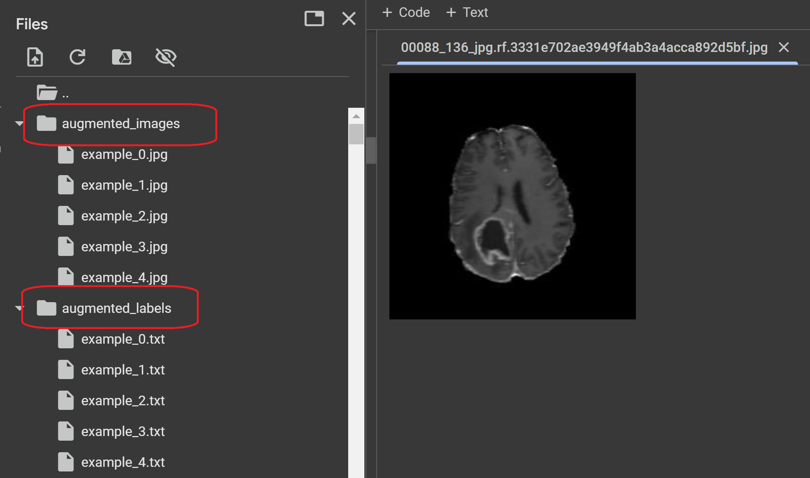

# Data Augmentation Pipeline for YOLO Datasets

This repository contains a Jupyter Notebook for augmenting images and YOLO-format bounding box annotations. The notebook uses the `albumentations` library to apply transformations like rotation, scaling, and flipping.

## Features
- Supports YOLO-format bounding box annotations.
- Augments images with various transformations.
- Displays original and augmented images for comparison.

## Requirements
To run the notebook, install the required Python libraries:
```bash
pip install -r requirements.txt
```



## LinkedIn Post

I shared more details about this project on LinkedIn! Check it out here:  
[My LinkedIn Post](https://www.linkedin.com/posts/mirza-riyasat-ali_machinelearning-objectdetection-dataaugmentation-activity-7286739494609846272-ckmd?utm_source=social_share_send&utm_medium=member_desktop_web)


